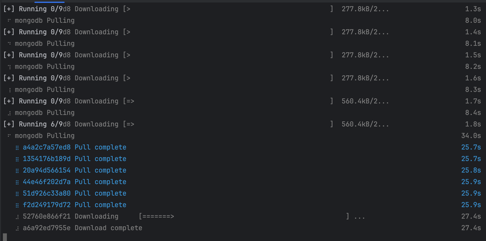
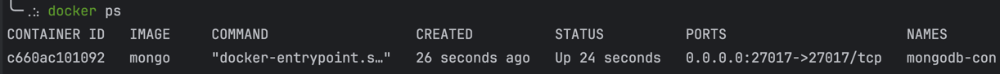

```___     ___     _       ___     ___     _              
  |   \   / _ \   | |     |   \   / _ \   | |       o O O 
  | |) | | (_) |  | |__   | |) | | (_) |  | |__    o      
  |___/   \___/   |____|  |___/   \___/   |____|  TS__[O] 
_|"""""|_|"""""|_|"""""|_|"""""|_|"""""|_|"""""| {======| 
"`-0-0-'"`-0-0-'"`-0-0-'"`-0-0-'"`-0-0-'"`-0-0-'./o--000'
```

# doldol
Clean-Architecture 적용한 doldol 이 프로젝트 (Toy Project)

JDK : java 21.0.2-graal -
설치 : /> sdk install java 21.0.2-graalce

GRADLE : 8.6 Version
설치 : /> sdk install gralde 8.6

# STEP1 -> 로컬에서 필요한 서비스 실행하기
1) 몽고 DB local start 하기 
2) 22
3) 22

> ```docker-compose up -d```

> ```docker ps``` 


도커 컴포즈 종료하기
> ```docker-compose down```

## 서비스 정보

## 아키텍처

## CI/CD

## SERVER INFO

## 기획 큰 도메인
   ### 회원
      - 가입 / 탈퇴 / 인증 / 주소

   ### 공지사항
      - 글쓰기 / 글수정 / 글삭제 / 글 Edit 선정
      - 첨부파일 / 이미지 어떻게 처리 할지 

   ### 예약 한거 나에게 알리기 기능   
   
    
## 기획 도메인별 서브 기획


## 기타 참고 링크
https://kimjingo.tistory.com/108
https://junuuu.tistory.com/950


